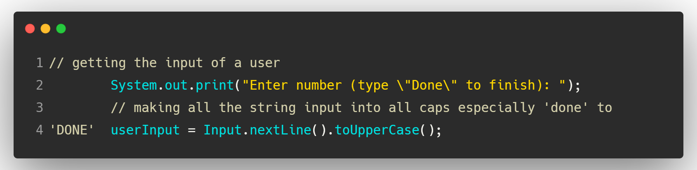
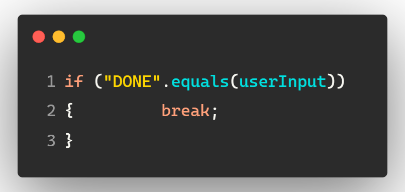
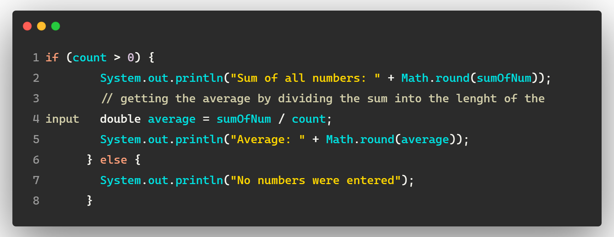

<h1 style = "text-align: center" >JAVA PROJECT 101</h1>

#### Hi everyone, I'm excited to share my first ever Java project with you. This is part of my journey learning how to code, and it's also a way for me to track my progress as I work on improving myself this year.

---

## This project is all about summing up the number and getting the average.

### Here is the Algorithm:

> - Start
>
> - Getting the user input (only number)
>
> - Keep getting the user input until the user entered the command "DONE"
>
> - Getting the sum of all input
>
> - Getting the average
>
> - End

### Code snippets

---

> Getting the user input:
> 
>
> Keep getting the user input until the user entered the command "DONE":
> 
>
> Getting the Sum and Average:
> 
```
if (count > 0) {
        System.out.println("Sum of all numbers: " + Math.round(sumOfNum));
        // getting the average by dividing the sum into the lenght of the input
        double average = sumOfNum / count;
        System.out.println("Average: " + Math.round(average));
      } else {
        System.out.println("No numbers were entered");
      }
```
>
> 1. This line checks if the variable **count** is greater than 0. The variable **count** likely represents the number of numbers that have been entered by the user. 
>> - If **count** is greater than 0, it means at least one number has been entered, and the code inside the **if** block will execute. 
>> - If **count** is less than or equal to 0, it means no numbers were entered, and the code inside the **else** block will execute.
> 2. **System.out.println("Sum of all numbers: " + Math.round(sumOfNum));**
>> - This line prints the sum of all the entered numbers.
>> - ***sumOfNum*** is a variable that stores the sum of the numbers entered.
>> - **Math.round(sumOfNum)** rounds the sum of the numbers to the nearest integer.
> 3. **double average = sumOfNum / count;**
>> - This line calculates the average of the entered numbers.
>> - It divides the ***sumOfNum*** by **count** (the number of numbers entered).
>> - The result is stored in the variable **average**, which is declared as a **double** to ensure accurate representation of the average value.
> 4. **System.out.println("Average: " + Math.round(average));**
>> - This line prints the calculated average.
>> - **Math.round(average)** rounds the average to the nearest integer.
> 5. **else { System.out.println("No numbers were entered"); }**
>> - This block executes if **count** is less than or equal to 0 (meaning no numbers were entered).
>> - It prints a message to the user, informing them that no numbers were entered.
---

